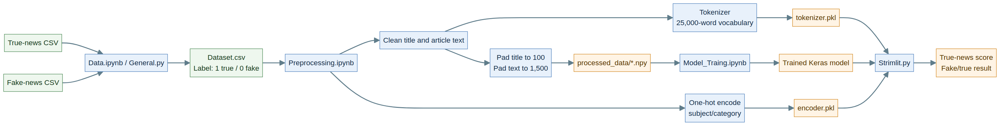
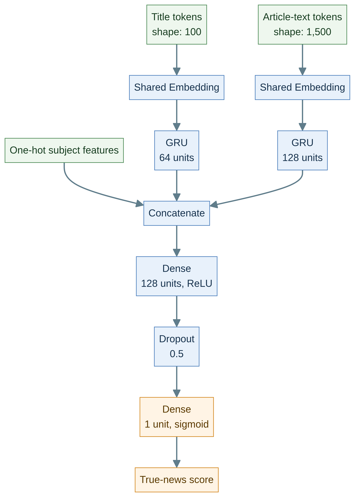

# Fake News Classifier

A machine-learning project for classifying news articles as **true** or **fake** news from their title, article text, and subject/category. The repository includes the data-preparation, preprocessing, model-training, and prediction notebooks, together with a Streamlit interface for interactive predictions.

> **Important:** This project is an educational classification tool, not a fact-checking authority. A prediction is based on patterns learned from the training data and should always be verified against reliable primary sources and independent reporting.

## Project overview

The complete workflow is shown below. Source CSV files are labeled and merged, transformed into model-ready arrays, used to train the classifier, and then consumed by the Streamlit application for interactive inference.



### Model architecture

The classifier combines separate recurrent representations for the title and article body with one-hot encoded subject features. The branches are merged before the final dense layers produce a sigmoid true-news score.



## Features

- Combines three inputs: news title, article text, and subject/category.
- Normalizes text by lowercasing, removing non-alphabetic characters, removing English stop words, and lemmatizing.
- Converts titles and article bodies to padded integer sequences using a saved Keras tokenizer.
- One-hot encodes the subject using a saved scikit-learn encoder.
- Uses a multi-input neural network with separate title and body text inputs plus categorical features.
- Provides an interactive Streamlit application with confidence, true/fake probabilities, a progress indicator, and sample examples.

## Repository layout

| Path | Purpose |
| --- | --- |
| `Strimlit.py` | Streamlit user interface and inference pipeline. The filename is retained as it exists in the repository. |
| `General.py` | Utility script that concatenates CSV files in the current directory into `Merged_True_False.csv`. |
| `Data.ipynb` | Notebook for preparing the true-news and fake-news source CSV files and adding labels. |
| `Preprocessing.ipynb` | Notebook for cleaning text, splitting the data, fitting the tokenizer/encoder, and exporting processed arrays. |
| `Model_Traing.ipynb` | Notebook for loading processed arrays, defining and training the neural network, and evaluating it. |
| `Prediction.ipynb` | Notebook for loading the tokenizer, encoder, and trained model and generating predictions. |
| `docs/fake-news-workflow.mmd` | Mermaid source for the project workflow diagram. |
| `docs/fake-news-workflow.png` | Rendered workflow diagram embedded in this README. |
| `docs/fake-news-model.mmd` | Mermaid source for the multi-input GRU architecture diagram. |
| `docs/fake-news-model.png` | Rendered model architecture diagram embedded in this README. |
| `tokenizer.pkl` | Serialized tokenizer used to convert text into integer sequences. |
| `encoder.pkl` | Serialized one-hot encoder used for the subject/category input. |
| `requirements.txt` | Python dependencies used by the notebooks and Streamlit app. |
| `processed_data/` | Generated training/test arrays created by `Preprocessing.ipynb`; not included in the current repository snapshot. |
| `Model_GRU_FAKE_TRUE.keras` | Model file expected by the Streamlit app; not included in the current repository snapshot. |

## How the pipeline works

1. **Collect and label data.** `Data.ipynb` reads the true-news and fake-news CSV sources, adds `Label = 1` to true articles and `Label = 0` to fake articles, and writes the merged dataset. `General.py` provides a simpler CSV concatenation utility when the source files are already in the same directory.
2. **Preprocess the dataset.** `Preprocessing.ipynb` reads `Dataset.csv`, normalizes the subject value `politics` to `politicsNews`, drops the `date` column, cleans the title and text, and performs an 80/20 train/test split.
3. **Encode model inputs.** A tokenizer with a vocabulary limit of 25,000 words is fitted on the training titles and article text. Titles are padded/truncated to 100 tokens and article bodies to 1,500 tokens. Subjects are one-hot encoded. The fitted tokenizer and encoder are saved as `tokenizer.pkl` and `encoder.pkl`.
4. **Export arrays.** The preprocessing notebook writes the token arrays, subject features, and labels under `processed_data/` as `.npy` files.
5. **Train the model.** `Model_Traing.ipynb` loads those arrays and trains a multi-input Keras model with Adam, binary cross-entropy, early stopping, up to 50 epochs, and a batch size of 64.
6. **Run inference.** `Strimlit.py` applies the same text preprocessing, loads the serialized tokenizer and encoder and the Keras model, then reports the model output as the true-news score. Scores of `0.60` or higher are shown as `TRUE NEWS`; lower scores are shown as `FAKE NEWS`.

## Requirements

- Python 3.9 or newer is recommended.
- A working TensorFlow installation compatible with your operating system and Python version.
- The packages listed in `requirements.txt`.
- The trained model file expected by the application.
- The serialized `tokenizer.pkl` and `encoder.pkl` files.
- NLTK `stopwords` and `wordnet` data. The Streamlit app downloads these resources on first run if they are not already available.

## Installation

Clone the repository and create an isolated environment:

```bash
git clone https://github.com/Zalanemoj/Fake-News-Classifier.git
cd Fake-News-Classifier

python -m venv .venv
source .venv/bin/activate        # Windows: .venv\\Scripts\\activate
python -m pip install --upgrade pip
pip install -r requirements.txt
```

The application downloads the required NLTK resources automatically. If you prefer to install them manually:

```bash
python -c "import nltk; nltk.download('stopwords'); nltk.download('wordnet')"
```

## Running the Streamlit app

Before starting the app, place a compatible trained model named `Model_GRU_FAKE_TRUE.keras` in the repository root. Then run:

```bash
streamlit run Strimlit.py
```

Open the local URL printed by Streamlit, enter a news title and article body, choose one of the supported categories, and select **Analyze**.

The supported category values exposed by the interface are:

- `News`
- `politics`
- `Government News`
- `left-news`
- `US_News`
- `Middle-east`
- `politicsNews`

These values must match the categories used when fitting `encoder.pkl`. If you replace the dataset or encoder, make sure the interface and training data use the same category vocabulary.

## Reproducing preprocessing and training

The notebooks are intended to be run from the repository root so their relative paths resolve correctly.

### 1. Prepare the dataset

Provide the source true-news and fake-news CSV files expected by `Data.ipynb`, or place the CSV inputs for `General.py` in the repository root and run:

```bash
python General.py
```

The utility writes `Merged_True_False.csv`. Review the resulting columns and rename or copy the final labeled dataset to `Dataset.csv` if that is the filename expected by `Preprocessing.ipynb`.

### 2. Run preprocessing

Open `Preprocessing.ipynb` in Jupyter or VS Code and run the cells in order. It creates:

```text
processed_data/
├── X_train_title.npy
├── X_train_text.npy
├── X_train_other.npy
├── X_test_title.npy
├── X_test_text.npy
├── X_test_other.npy
├── y_train.npy
└── y_test.npy
```

It also refreshes `tokenizer.pkl` and `encoder.pkl`.

### 3. Train and export the model

Run `Model_Traing.ipynb` after preprocessing. The model has three inputs:

1. A padded title sequence of length 100.
2. A padded article-text sequence of length 1,500.
3. One-hot encoded subject features.

After training, export the model in the native Keras format with the exact filename used by the application:

```python
model.save("Model_GRU_FAKE_TRUE.keras")
```

Keep the model architecture and preprocessing configuration synchronized with `Strimlit.py`; changing the vocabulary size, sequence lengths, subject categories, or input order makes existing artifacts incompatible.

## Known repository caveats

The current checked-in snapshot is not a fully self-contained runnable release:

- `Model_GRU_FAKE_TRUE.keras` is referenced by `Strimlit.py` and `Prediction.ipynb` but is not tracked in the repository. The app displays a model-file error until a compatible model is supplied.
- `Dataset.csv` and the generated `processed_data/` directory are also absent from the snapshot, so preprocessing and training require the original source data.
- `Model_Traing.ipynb` contains an export cell that pickles a model to `Model_Gru.keras`, while the application uses `load_model()` and expects `Model_GRU_FAKE_TRUE.keras`. Prefer `model.save("Model_GRU_FAKE_TRUE.keras")` for a Keras model consumed by the current app, and avoid treating the pickled artifact as interchangeable.
- The confidence displayed by the app is `max(score, 1 - score)`, which represents model certainty relative to the binary threshold, not a calibrated probability or a guarantee of factual accuracy.
- The preprocessing and inference code should be kept identical. In particular, the tokenizer, encoder, sequence lengths, subject vocabulary, and label convention must come from the same training run.

## Limitations and responsible use

The classifier can learn source- and dataset-specific writing patterns, including patterns that do not generalize to new publishers, topics, languages, or time periods. It does not verify claims, inspect citations, retrieve evidence, or determine whether a statement is true in the real world. Do not use it as the sole basis for editorial, legal, medical, financial, safety, or public-information decisions.

For a responsible review, compare the article with reputable sources, check the publication date and author, inspect the original documents or data behind important claims, and treat low-confidence or unexpected predictions as requiring further investigation.

## License

No license file is currently included in the repository. Until the project owner adds one, the reuse and redistribution terms should be treated as unspecified.
